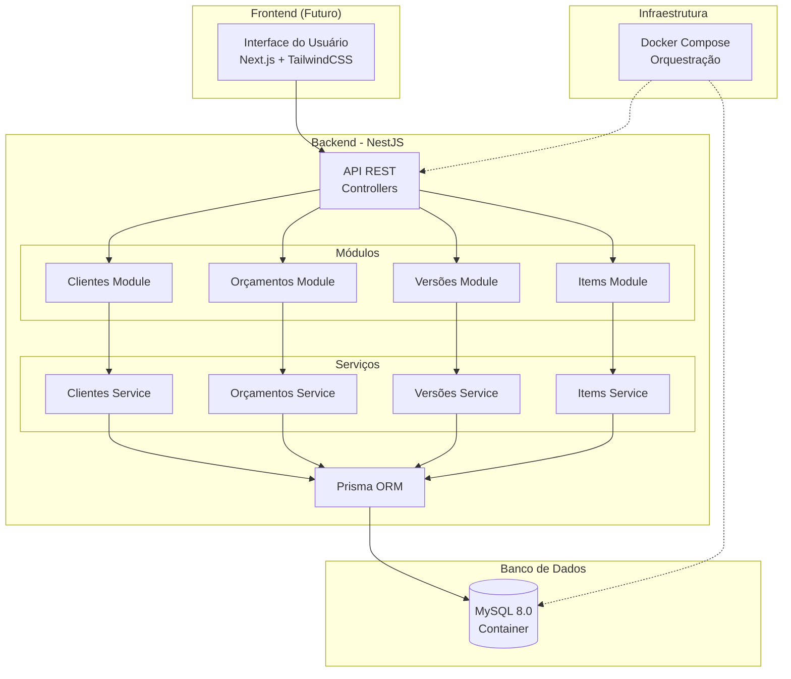
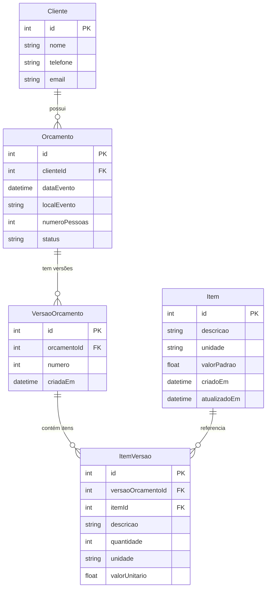
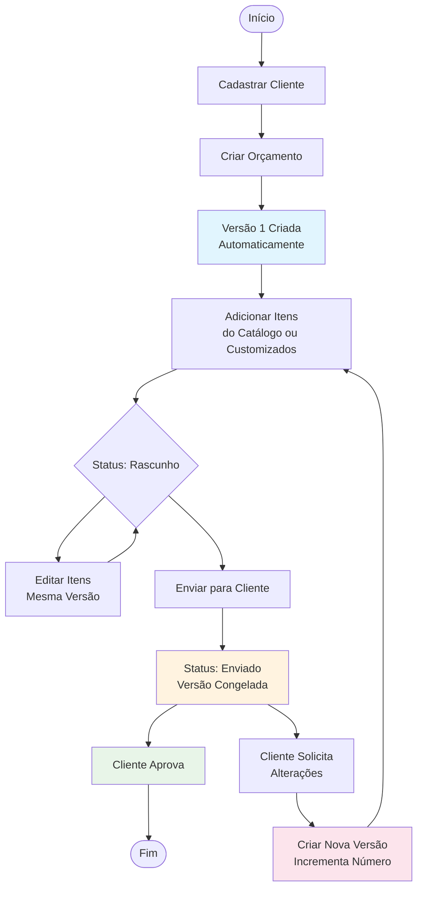
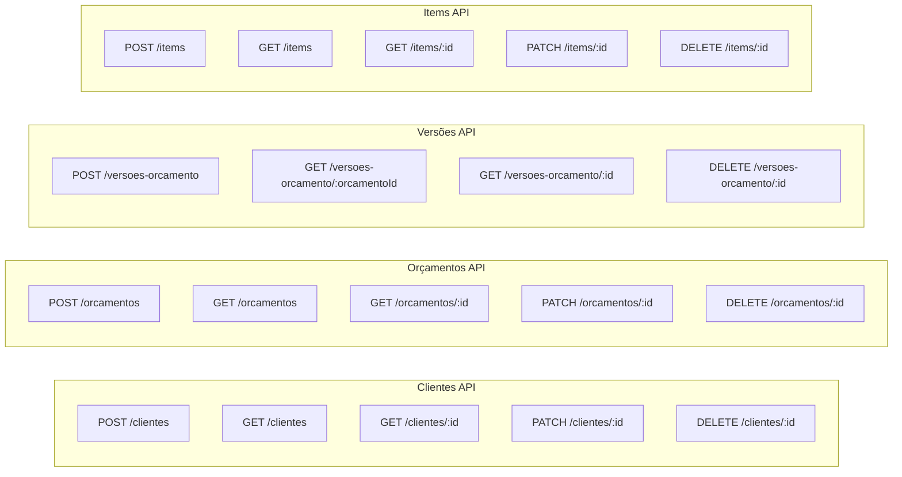
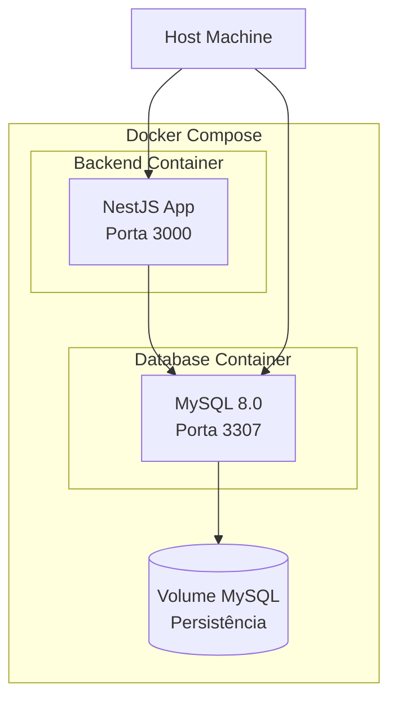

# Diagrama de Arquitetura - Sistema de Orçamento

## 🏗️ Arquitetura Geral

## 📊 Modelo de Dados

## 🔄 Fluxo de Negócio

## 🛠️ Endpoints da API

## 🐳 Containerização

## 📋 Características Principais

### ✅ Implementado
- **CRUD Completo**: Clientes, Orçamentos, Versões e Items
- **Versionamento**: Controle de versões de orçamentos
- **Catálogo de Items**: Reutilização de itens padrão
- **Items Customizados**: Criação de itens específicos por versão
- **Containerização**: Docker + Docker Compose
- **ORM**: Prisma com MySQL

### 🔄 Fluxo de Versionamento
1. **Orçamento criado** → Versão 1 automática
2. **Edições em rascunho** → Mesma versão
3. **Envio para cliente** → Versão congelada
4. **Solicitação de alteração** → Nova versão criada
5. **Histórico preservado** → Todas as versões mantidas

### 🎯 Próximos Passos
- Frontend em Next.js
- Autenticação e autorização
- Geração de PDFs
- Notificações por email
- Dashboard de relatórios